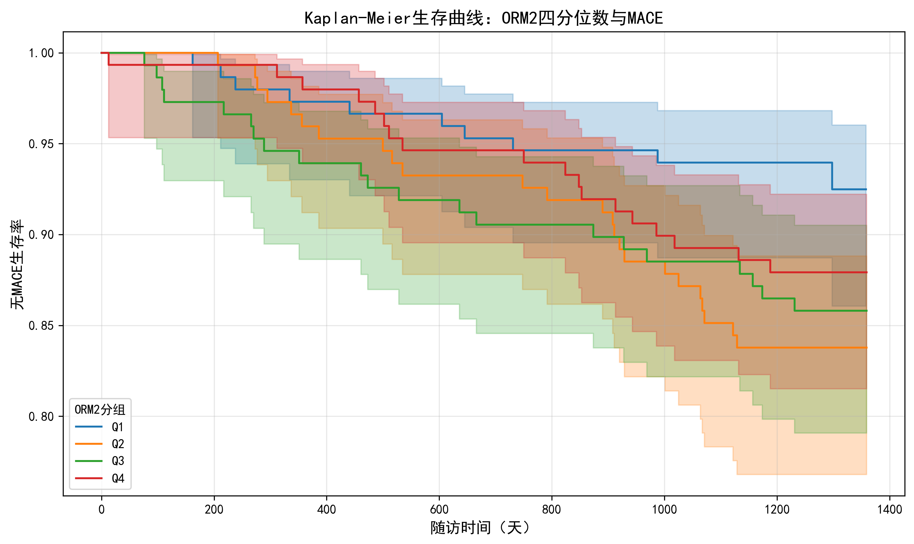
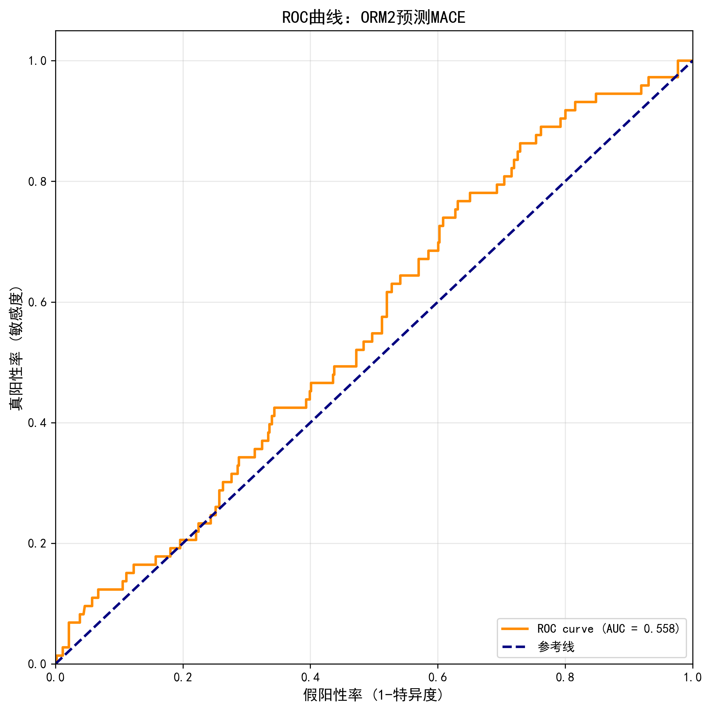

# ORM2与冠心病MACE和全因死亡的生存分析

本仓库包含ORM2（Orosomucoid 2，α1-酸性糖蛋白2）与冠心病患者主要不良心血管事件（MACE）和全因死亡关系的完整生存分析代码和结果。

## 📊 研究概况

- **研究人群**: 594例冠心病患者
- **主要结局**: MACE（72例，12.2%）、全因死亡（35例，5.9%）
- **主要发现**: ORM2中等水平升高与MACE风险显著增加相关（约2倍）

## 🔬 主要分析内容

### 1. 生存分析
- Kaplan-Meier生存曲线
- Log-rank检验
- Cox比例风险回归（单因素和多因素）

### 2. ORM2四分位数分析
- 四分位数分组（Q1-Q4）
- 递进校正模型：
  - 模型1: 粗模型（未校正）
  - 模型2: 校正年龄
  - 模型3: 校正年龄 + BMI

### 3. 预测价值评估
- ROC曲线分析
- 敏感度和特异度
- AUC计算

## 📁 文件结构

```
26.2.1/
├── 分析脚本/
│   ├── analyze_chd.py                          # 数据探索分析
│   ├── orm2_survival_analysis.py               # 完整生存分析（MACE + 全因死亡）
│   ├── orm2_quartile_cox_analysis.py           # 四分位数Cox回归
│   ├── orm2_quartile_multimodel_cox.py         # 多模型逐步分析
│   └── orm2_quartile_final_cox.py              # 最终版Cox回归（推荐使用）
│
├── 结果文件/
│   ├── ORM2四分位数_MACE_Cox回归最终结果.xlsx  # 主要结果表格 ⭐
│   ├── ORM2四分位数_MACE_Cox回归结果.xlsx
│   └── ORM2四分位数_多模型Cox回归结果.xlsx
│
├── 图表/
│   ├── KM_curve_MACE_by_ORM2_quartile.png      # MACE的KM曲线
│   ├── KM_curve_Death_by_ORM2_quartile.png     # 全因死亡的KM曲线
│   ├── ROC_curve_ORM2_MACE.png                 # MACE的ROC曲线
│   └── ROC_curve_ORM2_Death.png                # 全因死亡的ROC曲线
│
├── 分析报告/
│   ├── ORM2四分位数Cox回归完整报告.md          # 详细报告 ⭐
│   └── ORM2分析报告.md                         # 初步分析总结
│
└── 数据文件/
    └── 13.单独列出的冠心病.xlsx                # 原始数据
```

## 🎯 主要发现

### ORM2四分位数与MACE风险

| ORM2分组 | 粗HR (95% CI) | P值 | 校正HR* (95% CI) | P值 |
|---------|---------------|-----|-----------------|-----|
| Q1 (参考组) | 1.00 | - | 1.00 | - |
| Q2 | 2.48 (1.19-5.18) | **0.016** | 2.01 (1.07-3.76) | **0.029** |
| Q3 | 2.19 (1.03-4.64) | **0.042** | 1.78 (0.94-3.39) | 0.077 |
| Q4 | 1.71 (0.78-3.74) | 0.177 | 1.42 (0.73-2.77) | 0.301 |

*校正HR: 校正年龄和BMI

**P for trend = 0.253** (提示非线性关系)

### 关键结论

1. ✅ **ORM2中等水平升高（Q2、Q3组）与MACE风险显著增加**
   - Q2组风险增加约2倍（完全校正后仍显著，P=0.029）
   - Q3组风险增加约1.8倍（完全校正后边界显著，P=0.077）

2. ⚠️ **可能存在非线性关系**
   - 最高四分位数（Q4）风险增加不显著
   - 线性趋势检验不显著（P=0.253）
   - 提示需要进一步的非线性分析（如RCS）

3. ✅ **校正后关联依然存在**
   - 年龄和BMI不是主要混杂因素
   - ORM2与MACE的关联独立于传统危险因素

## 🚀 快速开始

### 环境要求

```bash
Python 3.8+
pandas
numpy
lifelines
scikit-learn
matplotlib
seaborn
openpyxl
```

### 安装依赖

```bash
pip install pandas numpy lifelines scikit-learn matplotlib seaborn openpyxl
```

### 运行分析

```bash
# 完整生存分析（推荐）
python 26.2.1/orm2_quartile_final_cox.py

# 查看结果
# 结果将保存在: ORM2四分位数_MACE_Cox回归最终结果.xlsx
```

## 📊 主要图表

### Kaplan-Meier生存曲线


### ROC曲线


## 📖 详细文档

- [ORM2四分位数Cox回归完整报告](26.2.1/ORM2四分位数Cox回归完整报告.md) - 包含详细的统计分析、结果解读和研究建议
- [ORM2分析报告](26.2.1/ORM2分析报告.md) - 初步生存分析总结

## 💡 下一步研究建议

1. **限制性立方样条（RCS）分析** - 探索剂量-反应关系的非线性模式
2. **扩展协变量** - 纳入糖尿病、高血压、吸烟史等传统心血管危险因素
3. **亚组分析** - 按年龄、合并症等进行分层分析
4. **全因死亡分析** - 使用相同方法分析全因死亡结局
5. **时间依赖分析** - 评估不同随访时间点的预测能力

## 📝 引用

如果您使用了本分析代码或方法，请引用：

```
ORM2与冠心病MACE和全因死亡的生存分析
GitHub Repository: https://github.com/luixinyan/ORM2-CHD-Survival-Analysis
```

## 👥 贡献者

- 主要分析: Claude Sonnet 4.5
- 研究设计和数据提供: luixinyan

## 📄 许可证

本项目仅用于学术研究目的。

## 📧 联系方式

如有问题或建议，请通过GitHub Issues联系。

---

**最后更新**: 2026年2月1日
